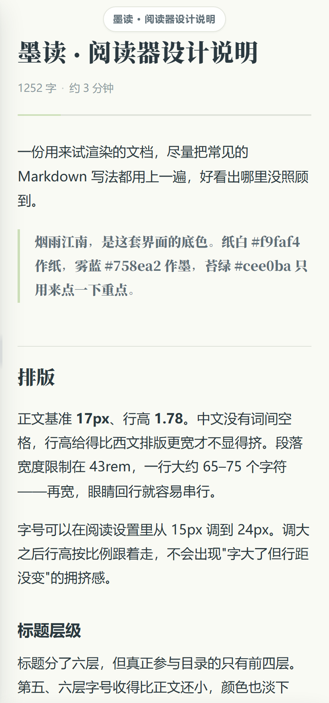
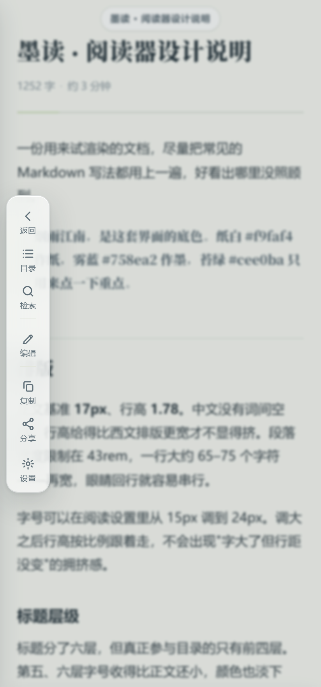
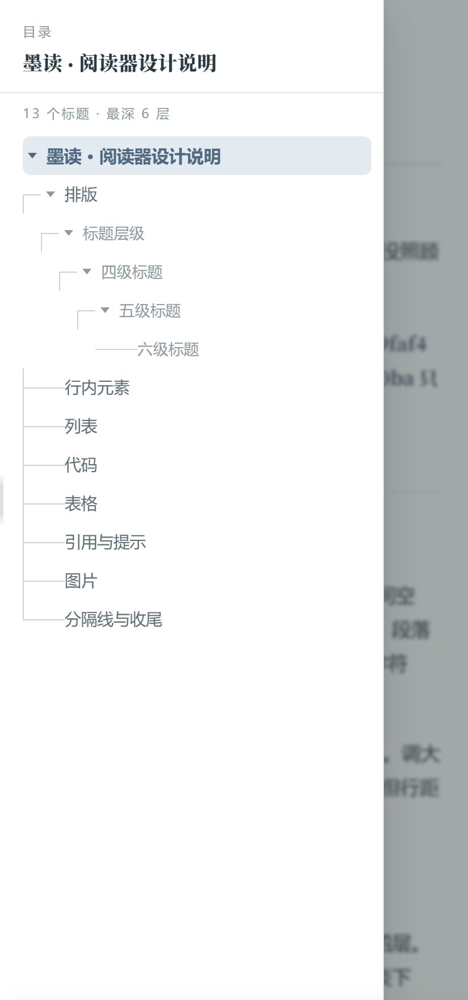
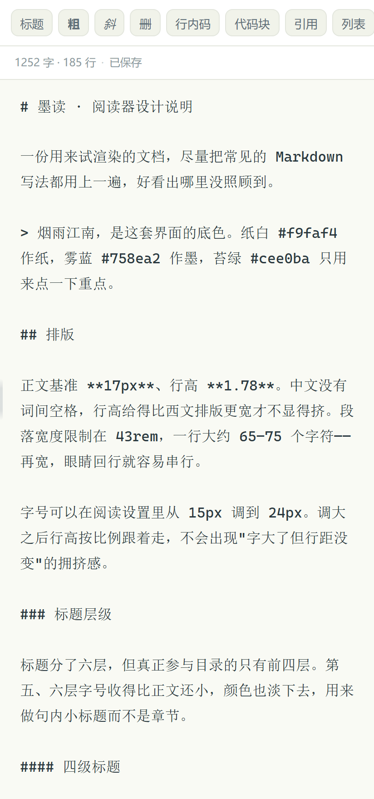
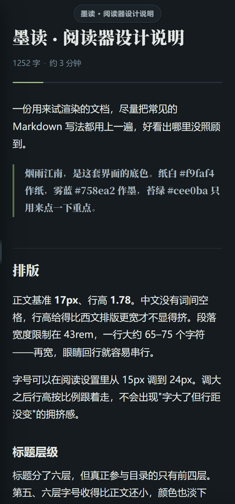

# 墨读

我给自己写的安卓 Markdown 阅读器，也能新建和编辑。纯本地、不联网、无广告、无账号。

配色是我从「烟雨江南」里挑的：纸白作纸，雾蓝作墨，烟灰画线，苔绿点重点。

| 阅读 | 右滑工具栏 | 目录结构图 | 编辑 |
|:---:|:---:|:---:|:---:|
|  |  |  |  |

> 这几张不是真机拍的。我这儿没有安卓设备，是用无头浏览器按手机视口截的——
> 网页侧跑的是和真机上一模一样的代码。为什么只能这么截，写在 [DESIGN.md](DESIGN.md) 里。

---

## 下载安装

**[⬇ 下载 MoRead-1.1.apk](https://github.com/qin-nai/MoRead/releases/latest)**

用手机点开安装，系统会提示「未知来源应用」，允许即可——这个包我没有上架任何应用商店。

- 要求 **Android 8.0** 及以上
- 装过 1.0 的话直接覆盖安装就行，阅读位置和「最近阅读」都在，用的是同一个签名
- 包里没有一条 `uses-permission`，**连 `INTERNET` 都没有**。这不是我在承诺不联网，
  是它根本没有联网的能力：所有本地文件都走自定义协议，请求不进网络栈
- 用的是调试签名，装机没问题，但升级必须还是这个签名，否则得先卸载再装

---

## 功能

**阅读**

- 标题、段落、粗体斜体、删除线、行内代码、引用、分隔线
- 代码块带语言标签和语法高亮（45 种语言），一键复制
- 有序 / 无序 / 任务列表，可以嵌套
- 表格，窄屏时横向滚动
- GitHub 风格的提示块 `> [!NOTE]`
- 脚注：正文里是上标，文末自动汇总，可以点进去再点回来
- 图片点击进灯箱，双指缩放、双击放大

**界面**

- **没有顶栏**。我让正文占满整屏，只在刚打开和滚回顶部时浮出一小条书名
- **在屏幕上右滑**，浮出一块毛玻璃工具栏：返回 / 目录 / 检索 / 编辑 / 保存 /
  复制 / 分享 / 设置。我没让它贴着屏幕边，是一张浮在正文上的圆角卡片，
  高度只包住条目、竖直居中
- **目录我画成文档的结构图**，不是一列标题。层级之间的连接线画成
  `├` `└` 那种骨架，可以折叠，收起时右侧显示这一支还藏着多少个标题
- 宽屏（平板、横屏）结构图自动变成右侧常驻，并跟着高亮当前章节
- 页内检索，命中高亮，回车跳到下一处
- 字号 15–24px、行距四档、代码自动换行开关
- 浅色 / 深色 / 跟随系统

  

- 阅读进度条、回到顶部
- **每份文档各记各的阅读位置**，下次打开接回去

**编辑**

- 全屏等宽编辑器，改动实时标「未保存」
- 语法工具条：标题 / 粗 / 斜 / 删 / 行内码 / 代码块 / 引用 / 列表 / 序号 /
  待办 / 链接 / 图片 / 表格 / 分割线 / 提示块
- 列表里回车自动续上标记，空项再回车退出列表
- 有未保存改动时按返回，会问「继续写 / 保存并退出 / 放弃改动」
- 从「单个文件」打开（没有文件夹授权）时保存会被拦下，就地引导补一次授权再重试

**首页**

- **授权一个文件夹，整个目录树一次摊开**。子文件夹连着里面的文档一起显示，
  画成结构图（和阅读页的目录是同一套骨架：`├` `└` 的连接线、每层缩进一格），
  文件夹名后面写着这一支底下有多少篇文档，点一下就折叠或展开
- 新建一份 `.md`，建完直接进编辑
- 从文件系统选单个文件，或者指定一个文件夹
- 文件夹里的每一层都可以按名称 / 按时间排
- 长按一行，在按住的地方弹出操作卡片（重命名 / 分享 / 删除）
- 最近阅读列表

**它不做的事**：不联网、不申请任何权限、不上传、不统计、没有账号。
不做文件管理器——我只能看到你亲自授权的那一个文件夹。

---

## 几件先知道的事

- **打开单个文件时，文档里的本地图片显示不出来，也不能保存。**
  安卓的存储授权管不到同目录的兄弟文件。保存那条会就地引导你补一次文件夹授权，
  图片那条得关掉重开（从文件夹里打开就没这个问题）。
- **不支持 LaTeX 公式**，`$...$` 会当普通文本显示。
- **左缘的返回手势让给了工具栏**，右缘返回不受影响，工具栏里也有「返回」。
- **首页那棵树最多读 8 层、1500 个条目**，超了只读前面一部分并在树底说明。
- **没在真机上做过完整走查。** 我这边没有安卓设备，也没装模拟器镜像；网页那一层
  有 108 项自动化测试兜着，原生那一层（首页、目录树、弹出层）只做到编译通过。
  遇到哪里不对，欢迎开 issue。

更细的取舍、我验证了什么没验证什么，都写在 [DESIGN.md](DESIGN.md) 里。

---

## 关于

界面整体跑在一个 WebView 里，外壳是原生 Java。渲染用
[marked](https://github.com/markedjs/marked) +
[DOMPurify](https://github.com/cure53/DOMPurify) +
[Prism](https://prismjs.com/)，都用的是本地打包的副本，没有 CDN。

我用 Android 的 SAF 直接读写你授权的文件夹，不碰 `INTERNET` 权限，
所以所有本地文件都走自定义协议，请求根本不进网络栈。

想看代码、自己编译、或者调界面，看 [DESIGN.md](DESIGN.md)。
第三方库许可见 [THIRD-PARTY-LICENSES.md](THIRD-PARTY-LICENSES.md)。

> 仓库目前还没有 LICENSE 文件。
